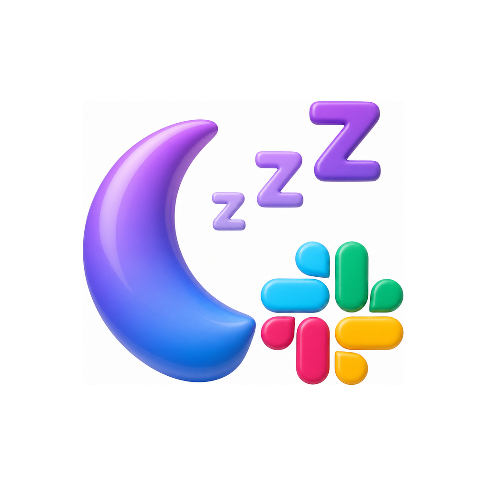
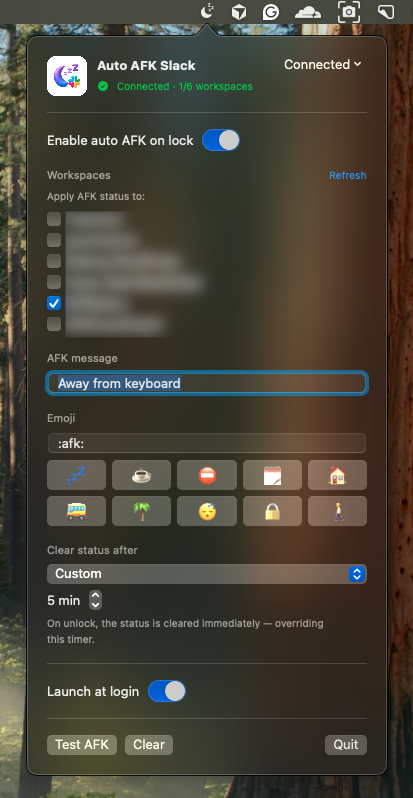
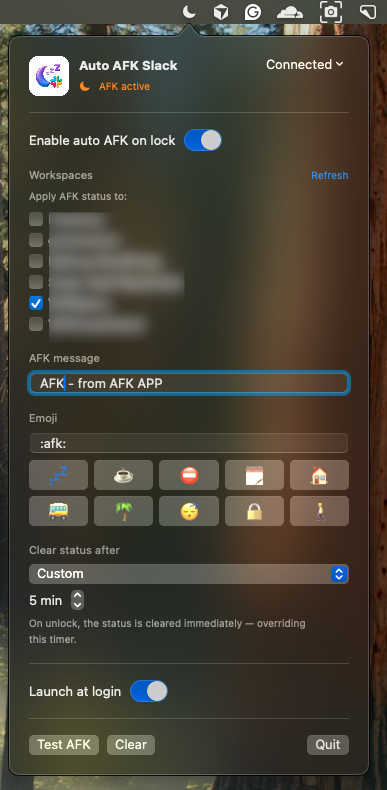
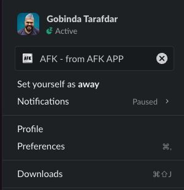

<div align="center">



# Auto AFK Slack

**Lock your Mac → your Slack status goes AFK. Unlock → it clears.**
A tiny, fully‑local macOS menu‑bar app. No login, no admin approval, no babysitting.

[](https://github.com/Gtarafdar/auto-afk-slack/releases/latest)
[](https://github.com/Gtarafdar/auto-afk-slack/releases)


[](LICENSE)

[**⬇ Download the latest release**](https://github.com/Gtarafdar/auto-afk-slack/releases/latest)  ·  [**🌐 Landing page**](https://gtarafdar.github.io/auto-afk-slack/)

`macOS 13+` · `Apple Silicon + Intel (universal)` · `≈ 2.4 MB` · `Free & open source (MIT)`

</div>

---

## What it does

The moment your Mac locks — manually or via auto idle‑lock — Auto AFK sets your Slack
status to your chosen message + emoji, with the expiry timer you picked. When you
unlock, it clears the status immediately (overriding the timer), just like cancelling a
status by hand.

It reuses the Slack session that already exists on your Mac (from the **Slack desktop
app**), so there's nothing to log into and no workspace admin to ask.

<div align="center">

| Menu‑bar panel | AFK active | Live in Slack |
| :---: | :---: | :---: |
|  |  |  |

</div>

## Features

- **Lock‑aware status** — sets AFK on lock, clears on unlock. Automatically.
- **Never overwrites your own status** — set “Lunch” or “In a meeting” yourself and it's
  preserved; the app only ever clears a status it set itself.
- **Respects Do Not Disturb & snooze** — a workspace that's snoozed or in DND is skipped.
- **Custom auto‑clear timer** — Slack presets (30 min, 1 hour, 4 hours, today, this week)
  plus your own custom minutes.
- **Pick your workspaces** — apply AFK to one workspace or several; tick exactly where.
- **Grabs every workspace for you** — reads all the workspaces you're signed into in the
  Slack app, so you never hunt for tokens. Just tick the ones you want.
- **No connect, no admin, no IT ticket** — it doesn't install a Slack app or need owner
  approval; it works on personal and company workspaces alike.
- **Featherweight** — event‑driven; it sleeps until your screen locks (no polling loop).
- **Runs every day** — one‑time install, optional launch at login, no restarts needed.
- **Native & tidy** — universal binary (Apple Silicon + Intel), menu‑bar only (no Dock
  icon), custom message & emoji.

## How it works

1. **Install & it self‑connects.** On first launch it reads your existing Slack desktop
   session locally:
   - the `xoxc` API token from Slack's Local Storage, and
   - the `d` / `d-s` cookies from Slack's cookie database (decrypted with the “Slack Safe
     Storage” Keychain key — this triggers a one‑time macOS Keychain “Allow” prompt, a
     local permission, **not** a login).
   Credentials are cached in your own Keychain item.
2. **You lock your Mac.** The app sets your message + emoji on the selected workspaces,
   with the chosen expiration.
3. **You unlock.** The status is cleared immediately — overriding the timer.

Your status lives on Slack's servers, so teammates see it everywhere, including the Slack
mobile app.

## Security & privacy

Your Slack session is sensitive, so the app is built to keep it local and safe:

- **Everything stays on your Mac.** It talks only to `slack.com` over HTTPS — the same
  thing the official client does. No analytics, no telemetry, no third‑party servers.
- **Secrets live only in your Keychain.** The cookie + per‑workspace tokens are stored in
  a single Keychain item marked **this‑device‑only**
  (`kSecAttrAccessibleAfterFirstUnlockThisDeviceOnly`), so they never sync to iCloud.
  Nothing sensitive is written to disk or `UserDefaults`.
- **No secrets in logs.** Tokens, cookies and your status text are never logged. Verbose
  diagnostics are off by default (`AUTOAFK_DEBUG=1` to opt in for support).
- **One local permission, easy to revoke.** The only prompt is the one‑time Keychain
  “Allow”. Hit **Disconnect** to delete the cached item, or “Sign out of all sessions” in
  Slack to invalidate the tokens.
- **Reviewed.** The code was put through an automated security review with **no critical,
  high, or medium findings**, plus defensive hardening (bounds‑checked local‑file
  parsing, header‑safe cookie handling).

The app is **not sandboxed** because it needs to read the Slack desktop app's local
session files and your Keychain. For public distribution, sign with a Developer ID
certificate and notarize (below) so Gatekeeper trusts it.

## Why it's useful (especially for remote teams)

- **Fewer “you there?” pings** — teammates see you've stepped away the second you lock.
- **Zero discipline required** — you already lock your Mac; accurate presence is a side
  effect of a habit you already have.
- **Your routine stays yours** — lunch, focus time and DND are respected.
- **Multi‑workspace life** — client, company and side‑project Slacks at once; choose where
  AFK applies and leave the rest alone.

## Requirements

| | |
| --- | --- |
| **macOS** | 13.0 Ventura or later |
| **Chip** | Apple Silicon or Intel (universal binary) |
| **Slack** | Desktop app installed & signed in |
| **Download** | ≈ 2.4 MB · `.dmg` |
| **Price** | Free & open source |

## Install

1. Download the latest [`AutoAFK-*.dmg`](https://github.com/Gtarafdar/auto-afk-slack/releases/latest) and open it.
2. Drag **Auto AFK Slack** into **Applications**.
3. First launch: right‑click the app → **Open** (it's ad‑hoc signed, so Gatekeeper asks
   once).
4. Approve the one‑time Keychain **Allow** prompt.
5. Click the menu‑bar moon → tick the workspaces you want, set your message, emoji and
   timer.

## Build from source

Requires Xcode 16 / Swift 5.9+.

```bash
./scripts/build_app.sh          # universal .app → dist/
./scripts/make_dmg.sh           # package dist/ → dist/AutoAFK-<version>.dmg
open "dist/Auto AFK Slack.app"
```

Run from source during development:

```bash
swift run
```

## Distribution

Ad‑hoc signing works for personal use. To share with others without Gatekeeper warnings,
sign with a Developer ID certificate and notarize (commands are printed at the end of
`scripts/build_app.sh`):

```bash
codesign --force --options runtime --sign "Developer ID Application: NAME (TEAMID)" "dist/Auto AFK Slack.app"
ditto -c -k --keepParent "dist/Auto AFK Slack.app" AutoAFK.zip
xcrun notarytool submit AutoAFK.zip --apple-id you@example.com --team-id TEAMID --password APP_SPECIFIC_PW --wait
xcrun stapler staple "dist/Auto AFK Slack.app"
```

## Landing page (GitHub Pages)

A full landing page lives in [`docs/`](docs/) and is published with GitHub Pages at:

**<https://gtarafdar.github.io/auto-afk-slack/>**

It serves from the `main` branch `/docs` folder (Settings → Pages → Deploy from a
branch → `main` → `/docs`).

## Caveats

The `xoxc` token + `d` cookie are unofficial and outside Slack's supported API surface.
They can rotate/expire — the app re‑reads them from the Slack desktop app automatically,
or you can pick **Refresh local session** from the menu. This approach is used
specifically to keep everything local and avoid Slack app‑install / admin approval.

## License

[MIT](LICENSE) © Gobinda Tarafdar.

---

<div align="center">
<sub>Slack is a trademark of Slack Technologies. This project is independent and unofficial.</sub>
</div>
